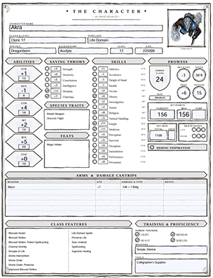
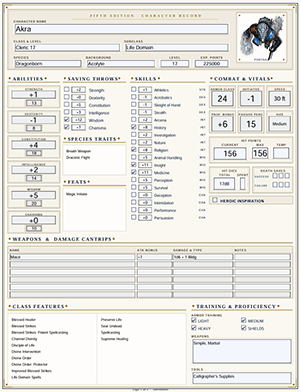
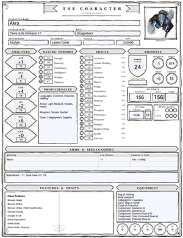
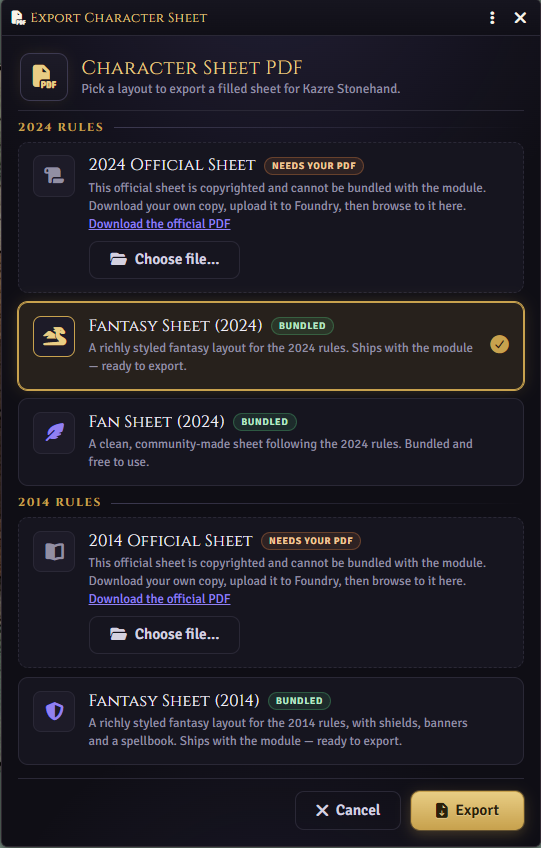

   
# Simple D&D PDF Character Sheet

A Foundry VTT module that turns any D&D 5e player character into a completed PDF character sheet. It reads everything straight from the actor's data and fills in the sheet, ready to print or save.

## Five supported layouts

The module ships with five character sheets fully mapped: the official D&D 2014 and 2024 sheets, plus three of my own design, so even if you don't have the official ones you can still export your character to PDF.

### Official D&D character sheets

Full support for both the official **D&D 2014** and **D&D 2024** character sheets. Due to licensing and copyright rules I can't bundle the official sheets in the module, but I've fully mapped both of them and provide the links so you can download the character sheet and then upload into your Foundry VTT server so this module can use it.

### Original character sheets

The other three are original, freely distributable designs of my own. They carry all the same fields as the official sheets, plus an embedded character portrait.

| 2024 Fantasy | 2024 Fan | 2014 Fantasy |
| :--: | :--: | :--: |
|  |  |  |

You simply pick the character sheet you want to use when you start the export process.

---

## Requirements

- **Foundry VTT** version 14 or newer
- **D&D 5e** game system version 5.3.3 or newer

There is nothing else to install or configure. The module bundles everything it needs, and no data is ever sent anywhere. The PDF is built entirely inside your browser and saved directly to your device.

---

## Generating a character sheet

The module adds a **PDF Character Sheet** button in two places.

### Actors sidebar

1. In the **Actors** sidebar, find the character you want to export.
2. Right-click their name to open the context menu.
3. Click **PDF Character Sheet**.

### Character sheet menu

1. Open the character's sheet.
2. Click the ... menu at the top right of the sheet.
3. Click **PDF Character Sheet**.

---

## What ends up on the sheet

The module pulls the character's current data from Foundry and lays it out on
the sheet. This includes:

- **Header**: name, class and level (including subclass and multiclass),
  species/race, background, alignment, and experience points.
- **Ability scores and skills**: scores, modifiers, saving throws, skill
  totals, and proficiency markers, plus passive Perception.
- **Combat**: armour class, initiative, speed, hit points (max, current, and
  temporary), hit dice, proficiency bonus, and death saves.
- **Attacks**: your equipped weapons with their attack bonuses and damage.
  Extra weapons and a spell-attack summary flow into the notes area beneath.
- **Proficiencies and languages**: armour, weapon, and tool proficiencies, and
  known languages.
- **Features and traits**: class features, species traits, feats, and
  background features, each printed with its name.
- **Equipment and currency**: carried items (with quantities) and coins.
- **Character details**: personality traits, ideals, bonds, flaws, appearance,
  and backstory.
- **Spellcasting**: spellcasting ability, save DC, attack bonus, spell slots,
  and your known or prepared spells. Prepared spells are marked as such.
- **Portrait**: on the 2014 sheet, both Fantasy Sheets and the Fan Sheet (2024),
  the character's portrait image is embedded into the sheet.

The generated PDF remains editable in a PDF reader, so you can tweak values by hand after exporting, or fill in anything the sheet left blank.

---

## Choosing the sheet layout

Every time you export, a small window opens asking **which layout to export the data to**. Simply pick one
and click **Export**. Your choice is remembered and pre-selected next time.

The options are:

- **Fantasy Sheet (2024)**: the default; our original hand-drawn "Inked Tome" layout.
- **Fantasy Sheet (2014)**: the same "Inked Tome" style laid out for the 2014 rules.
- **Fan Sheet (2024)**: our original "Modern Arcane" layout.
- **2024 Official Sheet** and **2014 Official Sheet**: Wizards of the Coast's own sheets. These
  appear as choices **only once you have provided your own copy** (see below).

### Looking to use the official 2014 / 2024 sheets

The official sheets are copyrighted and are not distributed with the module. To use one:

1. Download the PDF from D&D Beyond:
   - **2024 sheet:** <https://media.dndbeyond.com/compendium-images/free-rules/ph/character-sheet.pdf>
   - **2014 sheet:** <https://media.dndbeyond.com/compendium-images/marketing/dnd_5e_charactersheet_formfillable.pdf>
2. In the export dialog, next to the official sheet you want, click **Choose file…**, then upload or
   browse to the PDF you downloaded.
3. That layout is now a selectable option and stays available for future exports.

---

## Notes on how content fits

Character sheets have a fixed amount of space, and some characters have more
detail than a printed sheet can hold. The module handles this gracefully:

- **Spells** that don't fit the printed spell table on the 2024 sheet continue
  on additional pages appended to the PDF, so nothing is lost.
- **Weapons, features, and other lists** that overflow their box are trimmed to
  what fits. If something is left off, a note is written to the browser console.
- Long descriptions are converted to plain text and sized to fit their boxes.

If you ever suspect something is missing, open the browser console (press
**F12**) after generating a sheet. Any content that could not fit is reported
there. If you hit this, please open a GitHub issue so I can take a look.

---

## Troubleshooting

**The "PDF Character Sheet" option doesn't appear.**
Make sure you are right-clicking a **player character** (not an NPC), and that
you have at least Observer permission on that character. The option is hidden
otherwise.

**I get an error notification instead of a download.**
A message reading _"Failed to generate the PDF character sheet"_ means something
went wrong while building the file. Open the browser console (**F12**) to see
the details, and please include that information if you report the issue.

**The download didn't start.**
Check your browser's pop-up or download settings. The file is delivered as a
normal browser download, so anything that blocks downloads will block it too.

---

## Support and feedback

Bug reports and suggestions are welcome. Just log them in GitHub Issues. When reporting a problem, it helps to include the sheet layout you were using (2024 or 2014) and any messages from the
browser console.

---

## License

See the [LICENSE](LICENSE) file for details.
