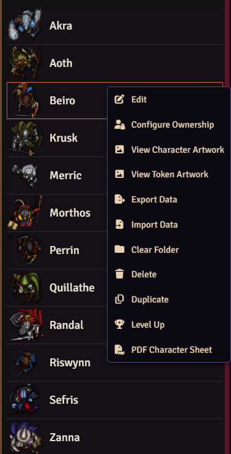
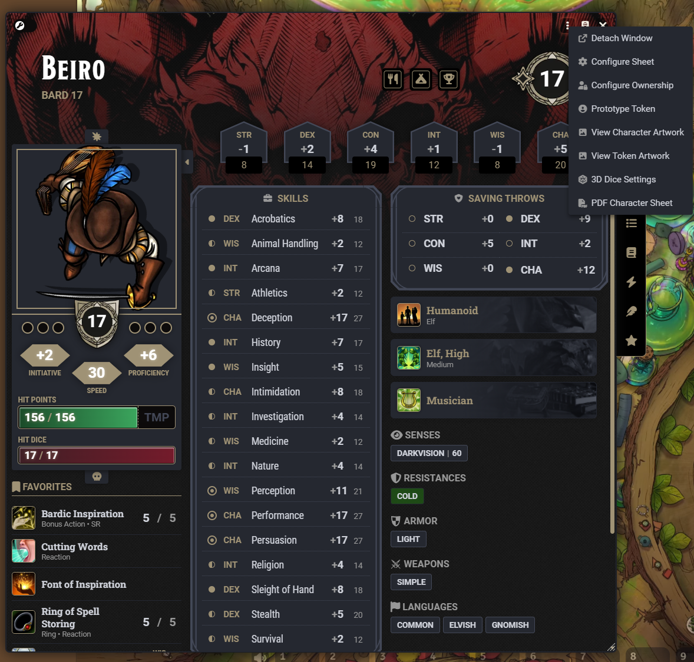
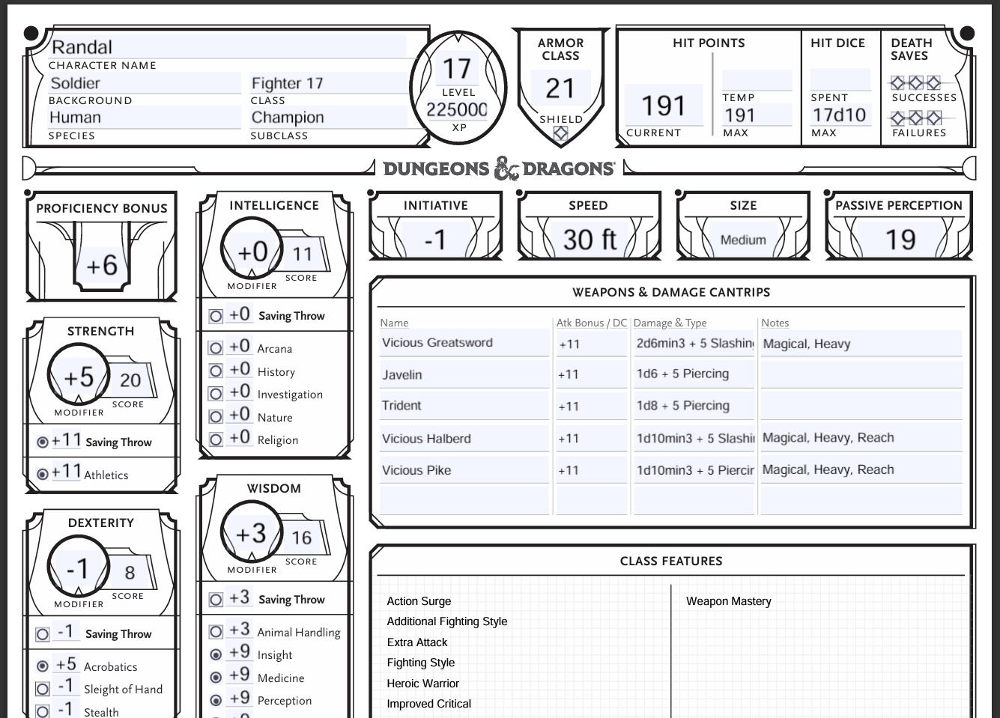
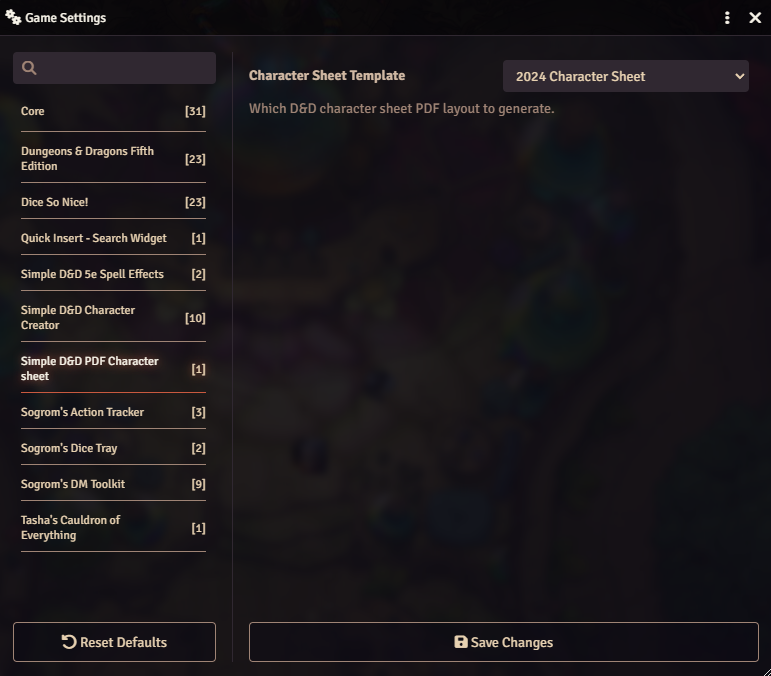

# Simple D&D PDF Character Sheet

A Foundry VTT module that turns any D&D 5e player character into a completed, PDF character sheet with a single click. It reads everything straight from the actor's data, fills in an official-style sheet, and downloads
it to your computer ready to print or save.

Supports both the **2024** and the **2014** character sheet layouts.

---

## Requirements

- **Foundry VTT** version 14 or newer
- **D&D 5e** game system version 5.3.3 or newer

There is nothing else to install or configure. The module bundles everything it needs, and no data is ever sent anywhere. The PDF is built entirely inside your browser and saved directly to your device.

---

## Generating a character sheet

The module adds a **PDF Character Sheet** button in two places

### Actors Sidebar
menu of characters in the Actors sidebar.

1. In the **Actors** sidebar, find the character you want to export.
2. Right-click their name to open the context menu.
3. Click **PDF Character Sheet**.

### Character Sheet Sidebar
in the menu system on the actors character sheet.

1. Open up the actors character sheet.
2. Click the ... menu at the top right of the sheet.
3. Click **PDF Character Sheet**.

---

## What ends up on the sheet

The module pulls the character's current data from Foundry and lays it out on
the sheet. This includes:

- **Header** — name, class and level (including subclass and multiclass),
  species/race, background, alignment, and experience points.
- **Ability scores and skills** — scores, modifiers, saving throws, skill
  totals, and proficiency markers, plus passive Perception.
- **Combat** — armour class, initiative, speed, hit points (max, current, and
  temporary), hit dice, proficiency bonus, and death saves.
- **Attacks** — your equipped weapons with their attack bonuses and damage.
  Extra weapons and a spell-attack summary flow into the notes area beneath.
- **Proficiencies and languages** — armour, weapon, and tool proficiencies, and
  known languages.
- **Features and traits** — class features, species traits, feats, and
  background features, each printed with its name.
- **Equipment and currency** — carried items (with quantities) and coins.
- **Character details** — personality traits, ideals, bonds, flaws, appearance,
  and backstory.
- **Spellcasting** — spellcasting ability, save DC, attack bonus, spell slots,
  and your known or prepared spells. Prepared spells are marked as such.
- **Portrait** — on the 2014 sheet, the character's portrait image is embedded
  into the sheet.

The generated PDF remains editable in a PDF reader, so you can tweak values by hand after exporting, or fill in anything the sheet left blank.

---

## Choosing the sheet layout (2024 or 2014)

You can pick which character sheet layout the module produces:

1. Open **Game Settings** (the gear icon).
2. Click **Configure Settings**.
3. Select **Module Settings**.
4. Under **Simple D&D PDF Character Sheet**, set **Character Sheet Template** to
   either **2024 Character Sheet** or **2014 Character Sheet**.

The default is the **2024** layout.

This is a per-user setting, so each person at the table can choose the layout
they prefer without affecting anyone else. The setting takes effect the next
time you generate a sheet.

---

## Notes on how content fits

Character sheets have a fixed amount of space, and some characters have more
detail than a printed sheet can hold. The module handles this gracefully:

- **Spells** that don't fit the printed spell table on the 2024 sheet continue
  on additional pages appended to the PDF, so nothing is lost.
- **Weapons, features, and other lists** that overflow their box are trimmed to
  what fits. If something is left off, a note is written to the browser console.
- Long descriptions are converted to plain text and sized to fit their boxes.

If you ever suspect something is missing, open the browser console (press
**F12**) after generating a sheet. Any content that could not fit is reported
there.

---

## Troubleshooting

**The "PDF Character Sheet" option doesn't appear.**
Make sure you are right-clicking a **player character** (not an NPC), and that
you have at least Observer permission on that character. The option is hidden
otherwise.

**I get an error notification instead of a download.**
A message reading _"Failed to generate the PDF character sheet"_ means something
went wrong while building the file. Open the browser console (**F12**) to see
the details, and please include that information if you report the issue.

**The download didn't start.**
Check your browser's pop-up or download settings. The file is delivered as a
normal browser download, so anything that blocks downloads will block it too.

---

## Support and feedback

This module is developed by **Iain Fielding** (Discord: _Sogrom_).

Bug reports and suggestions are welcome. Simply log them into the Github Issues. When reporting a problem, it helps to include the sheet layout you were using (2024 or 2014) and any messages from the
browser console.

---

## License

See the [LICENSE](LICENSE) file for details.
